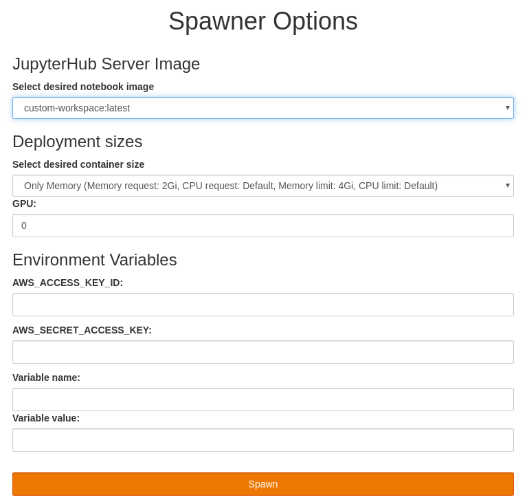

# Custom Jupyter Notebook Images

Since the list of images available in Open Data Hub by default is limited, we provide a simple way how to extend the list.

## Creating a Custom Jupyter Notebook Image

The images we offer and use in Open Data Hub JupyterHub are basd on [source-to-image]() tools and workflows provided by OpenShift.

You can follow the information available in [s2i-custom-notebook](https://github.com/AICoE/s2i-custom-notebook) repository on how to create custom images.

## Adding a Custom Jupyter Notebook Image

The list of images in JupyterHub UI are based ImageStreams available in the OpenShift namespace. You can list them using the following command:

```
oc get imagestreams -l opendatahub.io/notebook-image=true
```

They way they are recognized by JupyterHub is the label:

```
labels:
    opendatahub.io/notebook-image: true
```

You can see a few examples in [./images]() directory. Let's take one ImageStream as an example and add it to the JupyterHub instance

```
oc apply -f images/custom_notebook.imagestream.yaml
```

When you list the ImageStreams again, you'll see the new item

```
oc get imagestreams -l opendatahub.io/notebook-image=true
```

Let's start a rollout of JupyterHub to make sure it picks up the new image.

```
oc rollout latest jupyterhub 
```

You can now go to JupyterHub and you will see the new image listed in the dropdown.

